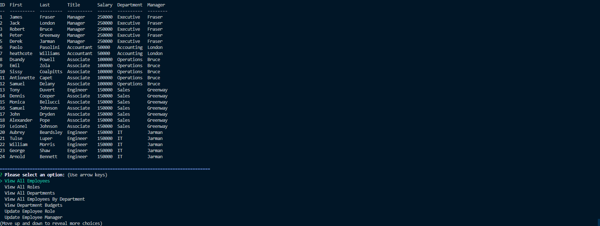

## Description
Created with VSCode.

A node.js application that uses user input from inquirer to populate a MySQL employee tracker database displaying employees of a company.
Allows user to check jobs, departments, names, and lists all from a database.

  ## Video Walkthrough
  [Video Example](https://drive.google.com/file/d/1QCzWoaJYWWbQvperTpMZz422nWfcUTaY/view)

  
  ## Installation
  Import all databases into mysql workbench
  then `npm install from the project directory` 
  
  
## Usage   
  
Run the following command at the root of your project and answer the prompted questions:
  
`npm start`

